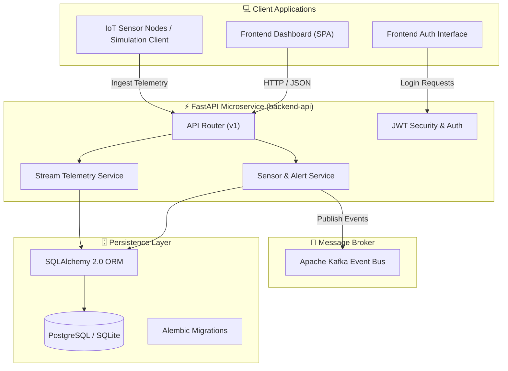

<div align="center">

# 🚀 StreamForge

### **Distributed Python Event Processing & Real-Time Telemetry Platform**

*A production-grade microservices architecture combining FastAPI, Apache Kafka, PostgreSQL / SQLAlchemy 2.0 ORM, Alembic, and a sleek Glassmorphism Single-Page Dashboard.*

[](https://www.python.org/)
[](https://fastapi.tiangolo.com/)
[](https://kafka.apache.org/)
[](https://www.postgresql.org/)
[]()

---

</div>

## 📖 Overview

**StreamForge** is an end-to-end distributed event processing and live streaming telemetry platform. Built for modern cloud-native environments, it ingests high-frequency IoT sensor measurements, tracks streaming video encoding quality (`1080p60 @ 6000 kbps`), monitors viewer chat velocity, and triggers real-time threshold alert incidents.

Whether monitoring distributed server clusters or live streamer engagement, StreamForge provides an interactive dashboard with dynamic data visualizations, live simulation triggers, and JWT role-based security.

---

## ✨ Core Features

### 🎥 1. Live Streaming & Video Encoding Telemetry
- **Video Stream Health Monitoring:** Tracks active channel encoding bitrates (`kbps`), frame rate (`FPS`), dropped frame percentages, and stream resolution (`1080p60`).
- **Viewer Engagement & Chat Velocity:** Aggregates peak concurrent viewers, chat message frequency (`msgs/min`), and live tip donation revenues.
- **Interactive Broadcast Simulation:** Live simulation engine (`POST /api/v1/streams/simulate`) allowing reviewers to trigger synthetic viewer bursts and bitrate drops on command.

### 📟 2. IoT Telemetry & Kafka Stream Processing
- **Event Streaming Pipeline:** Ingests high-throughput sensor telemetry payloads directly into **Apache Kafka** topics.
- **Automated Incident Triggers:** Real-time evaluation of warning (`>75°C`) and critical (`>90°C`) sensor threshold breaches with automated alert status tracking (`OPEN`, `ACKNOWLEDGED`, `RESOLVED`).

### 🔐 3. Security & Access Control
- **JWT Authentication:** OAuth2 password flow with JSON Web Tokens (JWT) and PBKDF2 / Bcrypt password hashing.
- **Role-Based Authorization:** Scoped endpoints for `ADMIN`, `OPERATOR`, and `VIEWER` roles.

### 🎨 4. High-Performance Dashboard UI
- **Modern Glassmorphism Design System:** Custom dark mode layout built with CSS HSL color tokens, micro-animations, and responsive grids.
- **Real-Time Data Visualizations:** Integrated **Chart.js** line graphs, bar heatmaps, and encoding performance charts.

### 🗄️ 5. Modular Database Architecture
- **SQLAlchemy 2.0 Async ORM:** Clean type-annotated domain models (`User`, `Channel`, `Stream`, `Sensor`, `Alert`, `ChatMessage`, `Donation`).
- **Alembic Database Versioning:** Structured migration history supporting both PostgreSQL and zero-config SQLite environments.

---

## 🏗️ Architecture & Data Flow



---

## 📁 Repository Structure

```text
axlero-intern-project-StreamForge/
├── backend-api/           # FastAPI backend microservice
│   ├── app/
│   │   ├── api/v1/        # Endpoints: auth, users, sensors, alerts, dashboard, streams
│   │   ├── core/          # Security, JWT tokens, exception handlers, logging
│   │   ├── db/            # Async SQLAlchemy engine & session lifecycle
│   │   ├── kafka/         # Kafka Producer & Consumer handlers
│   │   ├── models/        # ORM entities (User, Sensor, Alert, LiveStream)
│   │   ├── schemas/       # Pydantic data validation schemas
│   │   └── services/      # Business logic, analytics calculations & simulations
│   └── main.py            # FastAPI application entry point & DB seeders
│
├── frontend-dashboard/     # Real-time telemetry dashboard SPA
│   ├── css/               # Glassmorphism design system & component styles
│   ├── js/                # API client, Chart.js controller, streams manager, app router
│   └── index.html         # Main dashboard HTML shell
│
├── frontend-auth/          # User authentication UI
│
├── query-core/             # Database ORM models, CRUD logic & test suite
│   ├── src/               # Models, CRUD queries, configuration, seed script
│   └── verify_db.py       # SQLite in-memory verification test suite
│
└── query-migrations/       # Alembic migration management
    └── migrations/        # Schema migration version control scripts
```

---

## 🚀 Quick Start & Local Setup

### 1. Prerequisites
- **Python 3.10+**
- **Git**

### 2. Clone the Repository
```bash
git clone https://github.com/Sricharangoud/axlero-intern-project-StreamForge.git
cd axlero-intern-project-StreamForge
```

---

### 3. Launch Backend API Service (`backend-api`)

```bash
cd backend-api

# Create & activate Python virtual environment
python -m venv .venv

# Windows PowerShell:
.venv\Scripts\Activate.ps1
# macOS/Linux:
source .venv/bin/activate

# Install dependencies
pip install -r requirements.txt

# Start FastAPI server on port 8000
uvicorn app.main:app --host 127.0.0.1 --port 8000 --reload
```

- 🌐 **Interactive OpenAPI Docs (Swagger):** [http://localhost:8000/docs](http://localhost:8000/docs)
- 📖 **ReDoc Specification:** [http://localhost:8000/redoc](http://localhost:8000/redoc)
- ❤️ **Health Status:** [http://localhost:8000/health](http://localhost:8000/health)

---

### 4. Launch Frontend Dashboard (`frontend-dashboard`)

Open a new terminal window:
```bash
cd frontend-dashboard

# Start local HTTP server on port 8080
python -m http.server 8080
```

Open **[http://localhost:8080](http://localhost:8080)** in your browser.

#### Demo Credentials:
- **Username / Email:** `admin@streamforge.com` (or `admin`)
- **Password:** `Admin@12345` (or `password123`)

---

## 📡 API Reference Summary

| Method | Endpoint | Description | Auth Required |
| :--- | :--- | :--- | :---: |
| `GET` | `/health` | Service health check | ❌ |
| `POST` | `/api/v1/auth/login` | Authenticate user & obtain JWT Token | ❌ |
| `GET` | `/api/v1/users/me` | Fetch current logged-in user profile | `Bearer JWT` |
| `GET` | `/api/v1/sensors/` | List all registered sensor nodes | `Bearer JWT` |
| `POST` | `/api/v1/sensors/ingest` | Ingest sensor telemetry event into Kafka | `Bearer JWT` |
| `GET` | `/api/v1/alerts/` | Retrieve active threshold alerts & incidents | `Bearer JWT` |
| `POST` | `/api/v1/alerts/{id}/acknowledge` | Acknowledge open incident alert | `Bearer JWT` |
| `GET` | `/api/v1/streams/live` | Retrieve live channels & encoding metrics | `Bearer JWT` |
| `GET` | `/api/v1/streams/analytics` | Compute platform aggregate stream analytics | `Bearer JWT` |
| `POST` | `/api/v1/streams/simulate` | Interactively simulate viewer spikes & bursts | `Bearer JWT` |

---

## 🧪 Database Verification & Migrations

### Run Verification Test Suite (`query-core`)
```bash
cd query-core
python verify_db.py
```

### Apply Database Schema Migrations (`query-migrations`)
```bash
cd query-migrations
alembic upgrade head
```

---

## 📄 License
Maintained as part of the Axlero Internship project.
